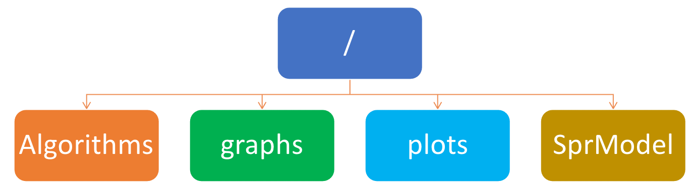

# Partition-Based Spreaders Identification

This repository provides the codes and data used for the partition-based spread identification performed for the paper "An efficient Partition-Based Approach to Identify and Scatter Multiple Relevant Spreaders in Complex Networks".

We have uploaded the paper to XX and has been published. It is available at https://. The Authors are Jedidiah Yanez-Sierra, Arturo Diaz-Perez and Victor Sosa-Sosa.

<!-- Code and data used for the partition-based scatterer identification experiments.
This repository contains the main source code and some experimental scripts for the experimental setups shown in the paper "An efficient Partition-Based Approach to Identify and Scatter Multiple Relevant Spreaders in Complex Networks." -->

The repository is organized as follows:

* **Algorithms**: source code containing the implementations of the PBSI method, as well as the reference methods. 
* **graphs**: the folder containing the input graphs used in each experiment (due to size limits, only small graphs are included). 
* **Plots**: output folder.
* **SprModel**: source code containing the implementations of the SIR propagation process.

The root folder contains the following scripts correlated with each experiment performed in the paper:
* **Exp1.py** Script containing the execution pipeline to compute the Final Spreading Scope achieved for a set of spreaders identified by the selected methods for a range of spreading probabilities. It receives as input the path of a complex network, the name of the set of methods, and the number of spreaders.
* **Exp2.py** Implementation to compute the Final Spreading Scope achieved by a range of spreaders identified by the selected methods for three distinct spreading probabilities. It takes as input a complex network, the range of spreaders, and the name of the set of methods. 
* **Exp3.py** Script used to compute the Average Shortest Path Length among the source spreaders selected by the methods selected. It takes as input a complex network, the range of spreaders, and the name of the set of methods. 
* **Exp4.py** Performs a comparison of the Final Spreading Scope achieved for each method using the distribution strategy used by PBSI. It takes as input a complex network, the spreading probability, and the name of the set of methods. 

### Input Graphs
* Input graphs must be in **GraphML** format. 
* Graphs must be connected with only one component. When more than one component is present, only the giant must be kept. 
* Additional graphs used in the paper can be downloaded from: 

| Network | url | 
| -: | :- |
| **USAir**             |  http://vlado.fmf.uni-lj.si/pub/networks/data/    |
| **NetSci**            |  http://networkrepository.com/netscience.php      |
| **Email EU Core**     | https://snap.stanford.edu/data/email-Eu-core.html |
| **PGP**               | http://networkrepository.com/PGPgiantcompo.php    |
| **CondMat**           | https://snap.stanford.edu/data/ca-CondMat.html    |
| **Email EU All**      | https://snap.stanford.edu/data/email-EuAll.html   |
| **Amazon**            | https://snap.stanford.edu/data/amazon0302.html    |
| **DBLP**              | https://snap.stanford.edu/data/com-DBLP.html      |
| **YouTube**           | https://snap.stanford.edu/data/com-Youtube.html   |
    

For each script, you need to specify all the above-described parameters, optional parameters to modify the number of Monte Carlo simulations, and SIR recovering probability are also available.  The results are stored in the **Plot** directory.

Python and libraries versions currently used:
| Library       | Version|
| --------------| ------:|
| python        | 2.7.16 |
| python-igraph | 0.8.3  |
| numpy         | 1.16.5 |
| matplotlib    | 2.2.3  |
